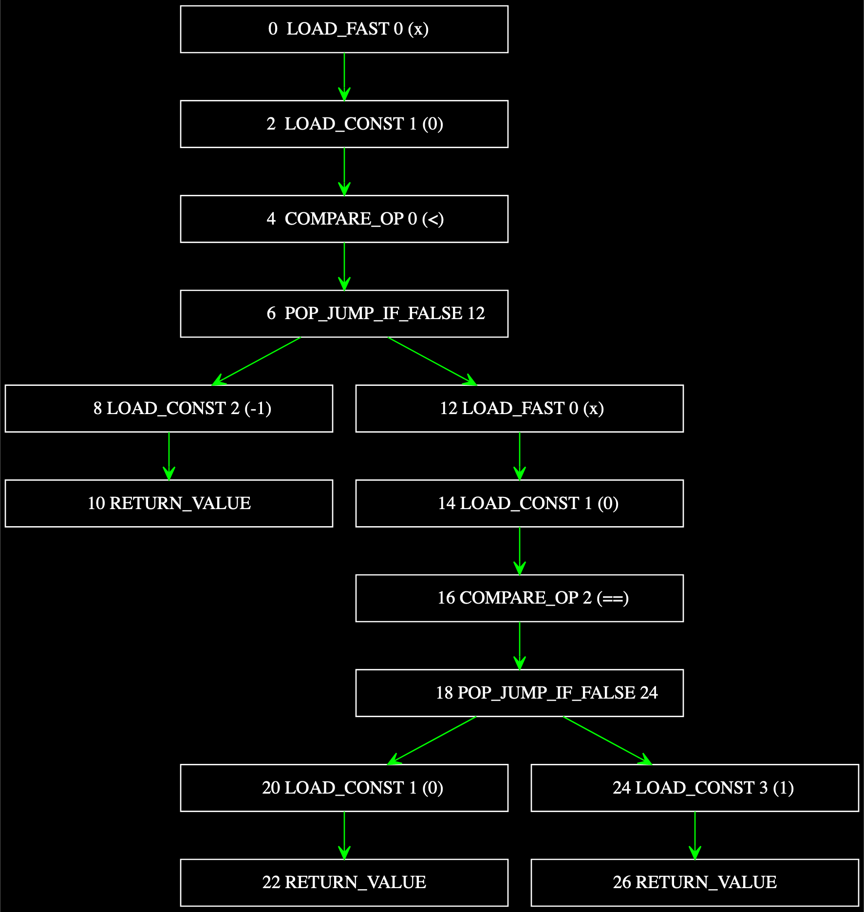

README
======

This is an **experimental project** for calculating `cyclomatic complexity <https://en.wikipedia.org/wiki/Cyclomatic_complexity>`_ measures (CCM) for Python source code by representing the associated `CPython bytecode instructions <https://docs.python.org/3/library/dis.html#python-bytecode-instructions>`_ as a `(connected) digraph <https://en.wikipedia.org/wiki/Directed_graph>`_.

Method
------

The calculation of the measures is made possible using the following method:

* From the given source code object - which could be a source fragment (string), or a `code object <https://docs.python.org/3.7/c-api/code.html>`_, or a function or callable - the (CPython) bytecode object is obtained using a `modifed version <https://github.com/sr-murthy/ccm/blob/master/src/ccm/xdis.py>`_ of the `dis library <https://docs.python.org/3.7/library/dis.html>`_ (an old version from Python 3.7), and the bytecode object is then disassembled into an instruction map of individual CPython bytecode instructions.
* Each instruction is classified as follows: an **entry point** if the instruction is the very first bytecode step of the callable, a **decision point** if the instruction involves a comparison (e.g. :code:`COMPARE_OP`), a **branch point** if the instruction is a branching instruction to another instruction (e.g. :code:`JUMP`), or an **exit point** if the instruction stops or interrupts execution of the callable and returns control flow back to the caller (e.g. :code:`RETURN_VALUE`, :code:`RAISE_VARARGS`).
* Using the `networkx library <https://networkx.org/>`_ the bytecode instruction map is represented as a **strongly connected directed graph**, called the **bytecode graph**, with nodes representing individual bytecode instructions, edges representing (explicit or implicit) transitions between instructions.

**Note**: often instructions may not be entry points, decision points, branch points or exit points, but simply transitional instructions that follow and are succeeded by other instructions in order of execution.

The bytecode graph will have all of the structural information about the number of nodes, edges, connected components and the like, in order to calculate the CCMs. Additionally, if we consider only source code representing individual functions or class methods, we can define an equivalence relation on the bytecode instructions in terms of the identity of their associated source lines. With a minor modification, this relation will yield a (strongly) connected digraph of the source lines - a source code graph - which is isomorphic to the quotient of the bytecode graph under this equivalence relation, and will yield the same complexity measures for a given source code object as the bytecode graph. This will be described in more detail with examples later on.

There are several CCMs that can be calculated with this approach:

1. McCabe complexity: :code:`#{edges} - #{nodes} + 2)`
2. Generalised McCabe complexity: :code:`#{edges} - #{nodes} + 2 * #{connected components})`
3. Henderson-Sellers complexity: :code:`#{edges} - #{nodes} + #{connected components} + 1)`
4. Henderson-Sellers & Tegarden complexity: :code:`#{edges} - #{nodes} + #{connected components})`
5. Generalised Henderson-Sellers & Tegarden complexity: :code:`#{edges} - #{nodes} + #{exit points per connected component} + 2)`
6. Harrison complexity: :code:`#{decision points} - #{exit points} + 2)`

A related measure, useful for software testing, is the number of **linearly independent paths** (so-called `basis paths <https://en.wikipedia.org/wiki/Basis_path_testing>`_) in the `directed acyclic graph <https://en.wikipedia.org/wiki/Directed_acyclic_graph>`_ (DAG) representation of a function's control flow. This number serves as an upper bound on the number of test cases required to cover all possible execution paths that the function could take. This will be described in more detail later.

**Note**: As noted `here <https://doi.org/10.1007/978-0-387-34848-3_51>`_ the standard McCabe complexity measure (1) only applies to individual functions or methods, which can be represented as a connected digraph with a single component. A class with more than one method, or a module with multiple functions and/or classes, is usually representable as a connected graph which is a disjoint union of components, and in these cases the generalised McCabe complexity (2), the Henderson-Sellers complexity (3), or related generalised measures, should be used instead.

Examples
--------

Some examples are given below, to illustrate the concept and measures of cyclomatic complexity, as described above, for Python source code, and the data structures and methods used to compute the measures.

First, consider the following simple Python implementation of the `sign function <https://en.wikipedia.org/wiki/Sign_function>`_, for determining whether a given number (integer or float) is negative, zero, or positive:

.. code-block:: python

   def sign(x: int | float) -> typing.Literal[-1, 0, 1]:
       if x < 0:
           return -1
       if x == 0:
           return 0
       return 1

Using :code:`dis.dis` this function can be disassembled into the following (CPython) bytecode:

.. code-block:: python

   2           0 LOAD_FAST                0 (x)
               2 LOAD_CONST               1 (0)
               4 COMPARE_OP               0 (<)
               6 POP_JUMP_IF_FALSE       12

   3           8 LOAD_CONST               2 (-1)
              10 RETURN_VALUE

   4     >>   12 LOAD_FAST                0 (x)
              14 LOAD_CONST               1 (0)
              16 COMPARE_OP               2 (==)
              18 POP_JUMP_IF_FALSE       24

   5          20 LOAD_CONST               1 (0)
              22 RETURN_VALUE

   6     >>   24 LOAD_CONST               3 (1)
              26 RETURN_VALUE

For more information on the details of the bytecode instructions, as displayed to the console, refer to the `dis documentation (Python 3.7) <https://docs.python.org/3.7/library/dis.html>`_, but a brief summary is given below of the values contained in the lines in the bytecode printout:

* The first value is an integer representing the (unique) number of the source code line associated with the bytecode instruction (block).
* The second value is an integer, called the `instruction offset <https://docs.python.org/3.7/library/dis.html#dis.Instruction.offset>`_, representing the (unique) index of the bytecode instruction relative to the starting point of the complete sequence of bytecode instructions, which are in ascending order of offset.
* The third value, called the `opname <https://docs.python.org/3.7/library/dis.html#dis.Instruction.opname>`_ is the human readable name of the associated bytecode operation.
* The (possibly null) fourth value is an `argument <https://docs.python.org/3.7/library/dis.html#dis.Instruction.arg>`_ (or parameter) to the bytecode operation (if any).
* The (possibly null) fifth value, in parentheses if not null, is a human readable `description <https://docs.python.org/3.7/library/dis.html#dis.Instruction.argrepr>`_ of the operational argument.

**Note**: instructions which are jump targets have offsets prefixed by :code:`>>` (refer `here <https://github.com/python/cpython/blob/3.7/Lib/dis.py#L234>`_).

The bytecode can be represented as the following DAG:

The unique entry point, and the decision points, branch points and exit points are clear from this representation, but are also stored at the level of bytecode instruction as attributes.

To compute the cyclomatic complexity measures, as defined above, for a given Python source code object the bytecode graph must be connected, i.e. there must be a path between any two nodes, in any direction. This is done in the bytecode graph via derived edges that link all exit points back to the entry point.

Here's an iPython session using the sign function as an example.

.. code-block:: python

   In [1]: from ccm.complexity import *

   In [2]: def sign(x) :
      ...:     if x < 0:
      ...:         return -1
      ...:     if x == 0:
      ...:         return 0
      ...:     return 1
      ...: 

   In [3]: mccabe_complexity(sign)
   Out[3]: 4

   In [4]: mccabe_generalised_complexity(sign)
   Out[5]: 4

   In [5]: henderson_sellers_complexity(sign)
   Out[5]: 4

   In [6]: henderson_sellers_tegarden_complexity(sign)
   Out[6]: 3

   In [7]: henderson_sellers_tegarden_generalised_complexity(sign)
   Out[7]: 7

   In [8]: harrison_complexity(sign)
   Out[8]: 1

All the complexity functions are based on calculations involving numeric properties of the bytecode graphs (:code:`ccm.graphs.XBytecodeGraph`, a custom subclass of :code:`nx.DiGraph`) obtained from the source code, such as the number of edges, nodes, connectivity features etc. As described above, the bytecode graph of a source code object is a connected digraph where nodes represent bytecode instructions and edges represent transitions between the instructions. Additionally, each instruction stores a number of attributes which classify the instruction as an entry point, branch point, decision point, or exit point, or none of these, depending on the instruction.

The bytecode graph for :code:`sign` can be obtained quite simply as follows:

.. code-block:: python

   In [9]: from ccm.graphs import XBytecodeGraph

   In [10]: G = XBytecodeGraph(code=sign)
   
   In [11]: G.nodes
   Out[11]: NodeView((0, 2, 4, 6, 12, 8, 10, 14, 16, 18, 24, 20, 22, 26))

   In [12]: G.edges
   Out[12]: OutEdgeView([(0, 2), (2, 4), (4, 6), (6, 12), (6, 8), (12, 14), (8, 10), (10, 0), (14, 16), (16, 18), (18, 24), (18, 20), (24, 26), (20, 22), (22, 0), (26, 0)])

**Note**: each node label is an instruction offset (the relative index of the instruction with respect to the complete, ordered sequence of all the bytecode instructions). The instruction map is an ordered dictionary keyed by tuples consisting of source line numbers and instruction offets, and values are :code:`ccm.xdis.XInstruction` objects. The instruction map can be obtained from the bytecode graph using the :code:`xbytecode.instr_map` nested attribute, e.g. for :code:`sign`:

.. code-block:: python

   In [13]: G.xbytecode.instr_map
   Out[13]: 
   OrderedDict([((2, 0),
                 XInstruction(opname='LOAD_FAST', opcode=124, arg=0, argval='x', argrepr='x', offset=0, starts_line=2, is_entry_point=True, is_jump_target=False, is_decision_point=False, is_branch_point=False, is_exit_point=False)),
                ((2, 2),
                 XInstruction(opname='LOAD_CONST', opcode=100, arg=1, argval=0, argrepr='0', offset=2, starts_line=2, is_entry_point=False, is_jump_target=False, is_decision_point=False, is_branch_point=False, is_exit_point=False)),
                ...
                ...
                ((6, 26),
                 XInstruction(opname='RETURN_VALUE', opcode=83, arg=None, argval=None, argrepr='', offset=26, starts_line=6, is_entry_point=False, is_jump_target=False, is_decision_point=False, is_branch_point=False, is_exit_point=True))])

**Note**: the last edge :code:`(6, 26)`, connecting the last instruction, which is the only exit point, with the first instruction, which is the entry point, makes the digraph strongly connected.

Each instruction object has a property named :code:`dis_line` which stores the :code:`dis.dis` console representation of the instruction, e.g.:

.. code-block:: python

   In [14]: G.xbytecode.instr_map[(2,0)].dis_line
   Out[14]: '  2           0 LOAD_FAST                0 (x)'

The console printed versions of the instructions are more human readable, and so it is possible to quickly identify classified instructions such as branch points, decision points and exit points in this way, e.g. for :code:`sign`:

.. code-block:: python

   In [15]: for instr in G.xbytecode.instr_map.values():
        ...:     if instr.is_entry_point:
        ...:         print(instr.dis_line)
        ...: 
        ...: 
     2           0 LOAD_FAST                0 (x)

   In [16]: for instr in G.xbytecode.instr_map.values():
        ...:     if instr.is_decision_point:
        ...:         print(instr.dis_line)
        ...: 
     2           4 COMPARE_OP               0 (<)
     4          16 COMPARE_OP               2 (==)

   In [17]: for instr in G.xbytecode.instr_map.values():
        ...:    if instr.is_branch_point:
        ...:        print(instr.dis_line)

     2           6 POP_JUMP_IF_FALSE       12
     4          18 POP_JUMP_IF_FALSE       24

   In [18]: for instr in G.xbytecode.instr_map.values():
        ...:     if instr.is_exit_point:
        ...:         print(instr.dis_line)
        ...: 
     3          10 RETURN_VALUE
     5          22 RETURN_VALUE
     6          26 RETURN_VALUE

If we define a simple equivalence relation on the bytecode instructions that two instructions are related if their associated source lines are identical, then the blocks of this relation correspond to the source lines. This means there is a connected digraph of the source lines, which we call the **source code graph**, which is the `quotient graph <https://en.wikipedia.org/wiki/Quotient_graph>`_ of the bytecode graph, under this equivalence relation, with one condition: in the special case of a source code object with just a single source line a looped edge is added between the single source line and itself.

The bytecode graph stores the associated source code graph in the :code:`source_code_graph` attribute, e.g. for the :code:`sign` function:

.. code-block:: python

   In [19]: G.source_code_graph
   Out[19]: <networkx.classes.digraph.DiGraph at 0x12105db90>

   In [20]: G.source_code_graph.nodes
   Out[20]: NodeView((4, 6, 2, 3, 5))

   In [21]: G.source_code_graph.edges
   Out[21]: OutEdgeView([(4, 6), (4, 5), (6, 2), (2, 4), (2, 3), (3, 2), (5, 2)])

**Note**: as with the bytecode graph, the source code graph has edges between any source line representing an exit point (if the associated bytecode instruction block contains an exit point) and the (unique) entry point. This is what makes the source code graph (strongy) connected. This includes the special case of a source code object with just a single source line.

The relationship between the bytecode graph and the source code graph for functions and class methods has a number of properties which are interesting to consider from the point of view of cyclomatic complexity:

* As the source code graph is the quotient of the bytecode graph under the equivalence relation described above, its nodes correspond to blocks of bytecode instructions associated with a unique source line. And adding an additional edge between any two instructions in a given instruction block does not change the quantity :code:`#{edges} - #{nodes}` for the bytecode graph. This means that edges between nodes in a given instruction block can be ignored, while only edges between instructions in different blocks count for :code:`#{edges} - #{nodes}`.

* There is only entry point in a bytecode graph, because it is defined as the first bytecode instruction (one with the unique offset :code:`0`). Thus there is only one source line in the source code graph associated with this entry point, namely, the first source line in the body of the source code object.

* Decision points, branch points and exit points in the bytecode graph are also associated 1-to-1 with unique source lines in the source code graph, and thus their numbers do not change in the source code graph.

* The bytecode graph is (strongly) connected with only one component, namely, itself, which means the source code graph is also (strongly) connected with only one component.

This means that the cyclomatic complexity measures, as defined above, will be the same for functions or class methods regardless of whether we use the source code graph or the bytecode graph. Here are two examples for McCabe complexity, using simple functions. First, the :code:`sign` function, which has five source lines (excluding the signature):

.. code-block:: python

   In [22]: G = XBytecodeGraph(code=sign)

   In [23]: G.nodes
   Out[23]: NodeView((0, 2, 4, 6, 12, 8, 10, 14, 16, 18, 24, 20, 22, 26))

   In [24]: G.edges
   Out[25]: OutEdgeView([(0, 2), (2, 4), (4, 6), (6, 12), (6, 8), (12, 14), (8, 10), (10, 0), (14, 16), (16, 18), (18, 24), (18, 20), (24, 26), (20, 22), (22, 0), (26, 0)])

   In [25]: G.number_of_edges() - G.number_of_nodes() + 2
   Out[25]: 4

   In [26]: G.source_code_graph.nodes
   Out[26]: NodeView((4, 6, 2, 3, 5))

   In [27]: G.source_code_graph.edges
   Out[27]: OutEdgeView([(4, 6), (4, 5), (6, 2), (2, 4), (2, 3), (3, 2), (5, 2)])

   In [28]: G.source_code_graph.number_of_edges() - G.source_code_graph.number_of_nodes() + 2
   Out[28]: 4

And the second, which is the identity function, with just a single source line:

.. code-block:: python

   In [29]: from ccm.xdis import dis as xdis

   In [30]: def identity(x):
        ...:    return x

   In [30]: xdis(identity)
     2           0 LOAD_FAST                0 (x)
                 2 RETURN_VALUE

   In [31]: H = XBytecodeGraph(code=identity)

   In [32]: H.nodes
   Out[32]: NodeView((0, 2))

   In [33]: H.edges
   Out[33]: OutEdgeView([(0, 2), (2, 0)])

   In [34]: H.number_of_edges() - H.number_of_nodes() + 2
   Out[34]: 2

   In [35]: H.source_code_graph.nodes
   Out[35]: NodeView((2,))

   In [36]: H.source_code_graph.edges
   Out[36]: OutEdgeView([(2, 2)])

   In [37]: H.source_code_graph.number_of_edges() - H.source_code_graph.number_of_nodes() + 2
   Out[37]: 2

Limitations
-----------

Currently, the functionality of bytecode graphs does not extend to Python classes or modules. This will be addressed in future versions.

Implications for Software Testing
---------------------------------

TODO

References
----------

.. [#R1] 1. Henderson-Sellers, B., Tegarden, D. (1995). A Critical Re-examination of Cyclomatic Complexity Measures. In: Lee, M., Barta, BZ., Juliff, P. (eds) Software Quality and Productivity. IFIP Advances in Information and Communication Technology. Springer, Boston, MA. https://doi.org/10.1007/978-0-387-34848-3_51
.. [#R2] 2. Harrison, W. A. (1984), Applying Mccabe's complexity measure to multiple-exit programs. Softw: Pract. Exper., 14: 1004-1007. https://doi.org/10.1002/spe.4380141009
.. [#R3] 3. dis - Disassembler for Python bytecode. https://docs.python.org/3.7/library/dis.html
